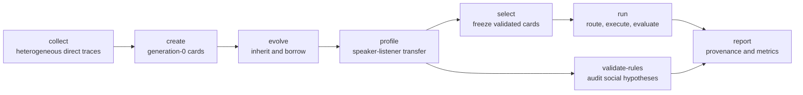

MDia is the primary framework; CLSR is its homogeneous-agent, concrete-LSF-routing special case.

# Machine Dialectology (MDia)

MDia is a test-time framework in which heterogeneous language-model agents create, inherit, exchange, profile, select, and route compact **Language Symbolism Frameworks (LSFs)**. An LSF is a persistent machine-dialect card, not a one-off shortened answer: it records a symbol inventory, grammar or schema, reasoning operators, validity rules, an answer contract, provenance, and validation evidence.

This repository now has one supported implementation under `src/mdia/`. The former `LSF-v0-draft`, `LSF-v1`, and `LSF-v2` trees are preserved under [`legacy/`](legacy/README.md) for provenance and are not the public API.

- MDia manuscript: [`papers/MDia_Jul17.pdf`](papers/MDia_Jul17.pdf)
- CLSR paper: [When LLMs Develop Languages: Symbolic Communication for Efficient Multi-Agent Reasoning](https://arxiv.org/abs/2606.29354)
- Related project: [Principia](https://github.com/pzqpzq/Principia)

## The pipeline



The implementation keeps four immutable partitions: `induction`, `evolution_validation`, `router_validation`, and `test`. Creation and evolution use only their designated partitions; profile-based route selection is frozen from validation evidence before any test prediction is scored.

## Quickstart: a complete offline run

Python 3.10 or newer is required. The toy preset uses redistributable fixtures and a deterministic replay provider, so it needs no API key or model download.

```bash
python -m venv .venv
source .venv/bin/activate
python -m pip install -e .
mdia pipeline --config configs/toy_mdia.yaml
```

The command creates a versioned directory beneath `runs/` containing the split manifest, direct traces, dialect generations, transfer profiles, a frozen bank, route plans, predictions, rule results, and a reproducibility report. Re-running with the same configuration and seed selects the same cards and routes.

To inspect the commands:

```bash
mdia --help
mdia pipeline --help
```

## Run one stage at a time

Each stage consumes the validated artifacts from the preceding stage in the same run directory.

| Stage | Command | Principal output |
|---|---|---|
| Collect direct answers | `mdia collect --config configs/toy_mdia.yaml` | `direct_traces.jsonl` |
| Create initial cards | `mdia create --config configs/toy_mdia.yaml` | generation-0 dialect bank |
| Iterate cards | `mdia evolve --config configs/toy_mdia.yaml` | generation checkpoints |
| Measure transfer | `mdia profile --config configs/toy_mdia.yaml` | transfer matrix and profiles |
| Freeze candidates | `mdia select --config configs/toy_mdia.yaml` | frozen dialect-bank manifest |
| Route and score | `mdia run --config configs/toy_mdia.yaml` | route plans and predictions |
| Validate rules | `mdia validate-rules --config configs/toy_mdia.yaml` | rule results and evidence links |
| Build the report | `mdia report --config configs/toy_mdia.yaml` | reproducibility report |

Use [`configs/clsr.yaml`](configs/clsr.yaml) for the homogeneous CLSR preset. Paper-oriented configurations live in [`configs/paper/`](configs/paper/) and require the corresponding licensed datasets and provider access; they are not part of the offline smoke test.

## What does the router route?

This distinction resolves the ambiguity in the former v1/v2 names.

| Interface | It selects | Its output | Role |
|---|---|---|---|
| `DialectRouter` | Concrete, frozen evolved LSF cards | Stable dialect IDs plus specification digests | Primary MDia and CLSR routing |
| `ControllerRouter` | A metadata-conditioned answer/controller family, such as schema-first or verifier-rich | A controller ID and answer contract | Optional policy layer for format-sensitive tasks |

`DialectRouter` supports `single`, `aggregate`, `compose`, and guarded `abstain/raw-fallback` plans. Aggregate policies distinguish majority, validation-weighted, score-based, and judge aggregation. Every plan is limited by an explicit generated-token budget and stopping rule.

The archived former v2 package is a **controller router**: it maps observable benchmark metadata to handcrafted prompt strategies. It does not retrieve evolved LSF cards. A canonical run may record both choices, but it never calls the controller choice a concrete-LSF route.

Before generation, either router may use query text and observable metadata, listener profiles, frozen validation statistics, and budget information. It cannot access gold labels, test outcomes, or feedback from a candidate answer.

## MDia and CLSR

CLSR introduced the create-evolve-route lifecycle for reusable LSFs in a homogeneous model community. MDia retains that lifecycle and expands the unit of analysis to a **speaker-listener-dialect-task event** across heterogeneous model families.

The `clsr.yaml` preset therefore:

- constrains creators, speakers, and listeners to one backbone community;
- keeps concrete-card single, aggregate, and compose routing;
- includes a fixed-single, validation-profiled baseline; and
- disables claims that require cross-family ecology or transfer.

CLSR is not “v0” of the public package and MDia is not “v2.” Both are configurations of the same schema and CLI, with MDia as the general framework.

## Dialect lifecycle

A card implements the manuscript contract `D = (V, G, O, R, rho)`:

- `V`: finite symbol inventory;
- `G`: grammar or output schema;
- `O`: reusable reasoning operators;
- `R`: validity, usage, and avoidance rules; and
- `rho`: empirical profile, including validation utility, cost, failure modes, and listener compatibility.

Cards also carry a stable ID, generation, parents, speaker/creator provenance, task tags, I/O contract, fallback, and a digest of the complete specification. Correct direct traces are ranked by completion-token count per item; optional speaker-diversity constraints prevent one model from monopolizing generation 0. Evolution preserves vertical inheritance and records horizontal borrowing. Selection uses validation profiles, minimum support, Pareto filtering, and diversity constraints - never filename order or test accuracy.

See [Pipeline and artifacts](docs/pipeline.md) and [Architecture](docs/architecture.md) for the complete data flow and extension interfaces.

## Sociolinguistic rule bank

MDia operationalizes 100 falsifiable hypotheses across seven manuscript families:

1. receiver/listener;
2. speaker/publicness;
3. task-conditioned;
4. compression/redundancy;
5. routing/code-switching;
6. archive/evolution; and
7. robustness, scale, and deployment.

The manuscript reports **full or strong support for 19 rules** in its audited archive, including listener-openness asymmetry, public-dialect asymmetry, weak-speaker teaching, foreign-dialect risk, route simplicity, task-aware routing, parser-compatible compactness, and negative-transfer guards. These labels are paper evidence, not universal laws and not automatically reproduced by installing this package.

The CLI preserves the manuscript label (`full`, `strong`, `partial`, `weak`, `boundary`, or `unsupported`) separately from the status of the current execution. If required data are absent, the result is `not_evaluated`; legacy heuristic scores are never promoted to fresh validation evidence. Multiple-testing correction is applied within each of the seven families.

See [Rule validation](docs/rules.md) for evidence streams, statistics, and reporting limits.

## Reproduction levels

| Tier | Requires | Purpose |
|---|---|---|
| Offline fixture | This repository only | Verify schemas, lifecycle, routing, rules, and deterministic provenance |
| Adapter run | User-supplied or public-compatible dataset plus provider | Exercise MDia on a new model/task without claiming paper reproduction |
| Paper protocol | Exact manifests, model revisions, evaluators, seeds, and release artifacts | Reproduce a named manuscript table or analysis |

Only redistributable fixtures and compact example artifacts belong in Git. Larger sanitized archives should be published as versioned release assets with SHA-256 manifests. Restricted benchmark text, API usage ledgers, full private prompts, credentials, and remote paths must not be committed. Lightweight evaluators are diagnostic unless a benchmark's official harness adapter is used.

Read [Reproduction and data policy](docs/reproduction.md) before interpreting any number.

## Repository map

```text
src/mdia/          canonical schemas, lifecycle, routing, evaluation, and rules
configs/           offline, CLSR, and paper-oriented presets
examples/toy/      redistributable deterministic fixture
artifacts/example/ committed complete offline example output
docs/              architecture, pipeline, reproduction, extension, and rules
papers/            manuscript snapshot included with this release
legacy/            archived v0/v1/v2 research workspaces; noncanonical
tests/             unit, leakage, integration, and offline end-to-end checks
```

## Documentation

- [Architecture](docs/architecture.md)
- [Pipeline and artifacts](docs/pipeline.md)
- [Paper-to-code map](docs/paper-to-code.md)
- [Reproduction and data policy](docs/reproduction.md)
- [Extending datasets and providers](docs/extending.md)
- [Rule validation](docs/rules.md)
- [Legacy history](docs/legacy.md)

## Legacy workspaces

| Historical name | Archived location | What it actually contains |
|---|---|---|
| `LSF-v0-draft` | [`legacy/clsr-v0-workspace/`](legacy/clsr-v0-workspace/STATUS.md) | Early CLSR scripts and the recovered meta-LSF prompt bank |
| `LSF-v1` | [`legacy/mdia-v1-workspace/`](legacy/mdia-v1-workspace/STATUS.md) | Heterogeneous LSF evolution, concrete-card transfer, and experimental routing artifacts |
| `LSF-v2` | [`legacy/mdia-strategy-router-v2/`](legacy/mdia-strategy-router-v2/STATUS.md) | Metadata-conditioned handcrafted strategy/controller routing, not evolved-card routing |

The snapshot tag `pre-mdia-reorg-2026-07-30` points to the repository immediately before this migration. Legacy code is retained for auditability; use the root package for new work.

## Security

Use `.env.example` as a list of environment-variable names if a non-offline provider needs credentials. Export them through your shell or secret manager; the package does not parse `.env` files. Never place a secret in YAML, JSON, Python, a command transcript, or an experiment artifact. Generated model text in `legacy/` is untrusted data and must never be executed. Credentials previously present in private remote workspaces are outside this release and must be rotated by their owner before any remote-derived artifact is published.

## Citation and license

Use [`CITATION.cff`](CITATION.cff) for software citation and cite the relevant MDia and/or CLSR manuscript for research claims. Code is released under the [MIT License](LICENSE). Dataset and model licenses remain with their respective owners.
