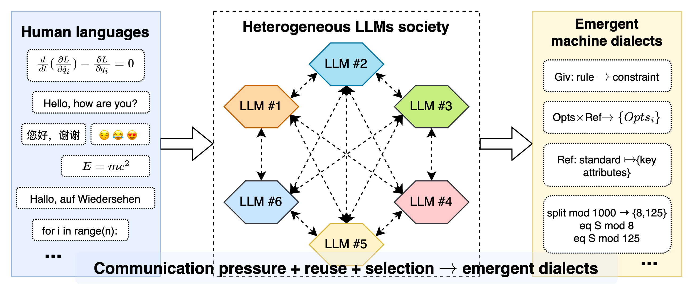
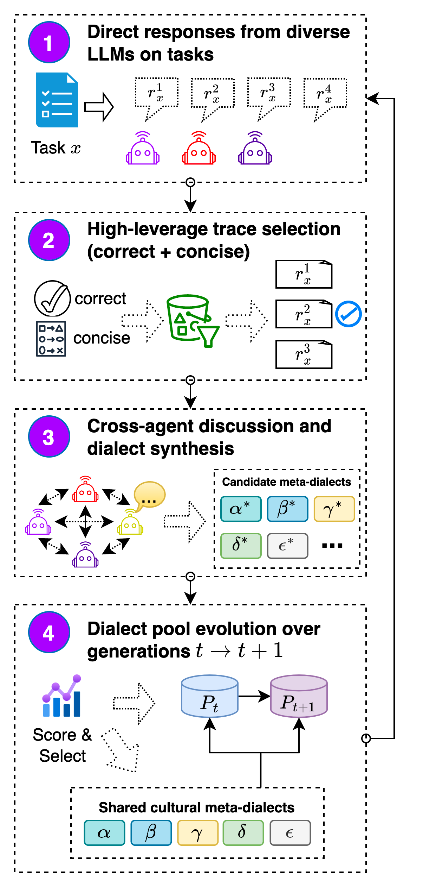
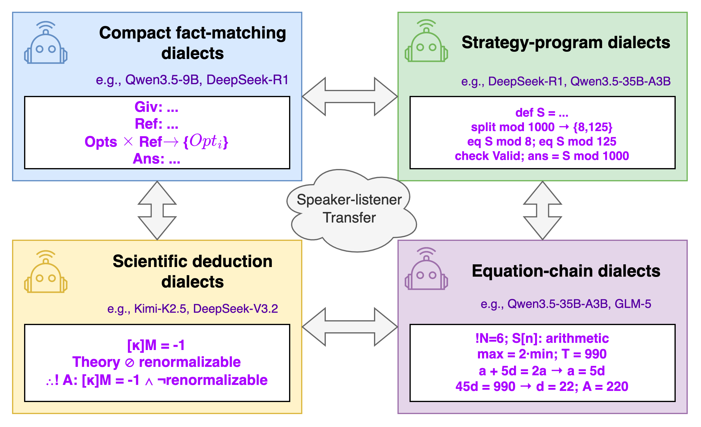
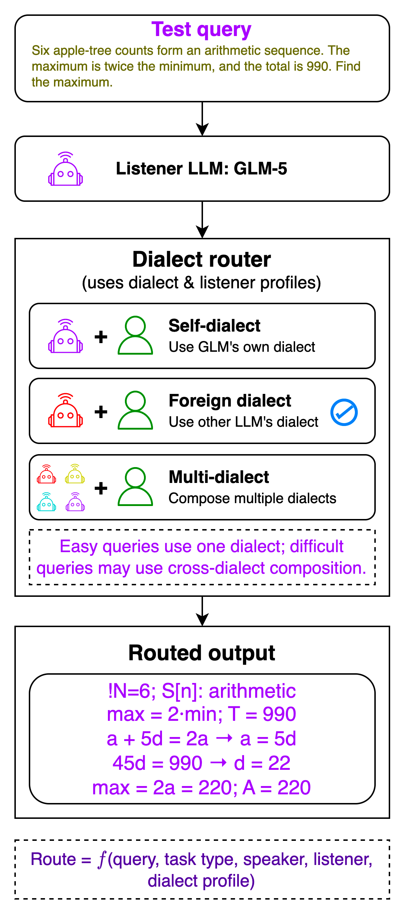
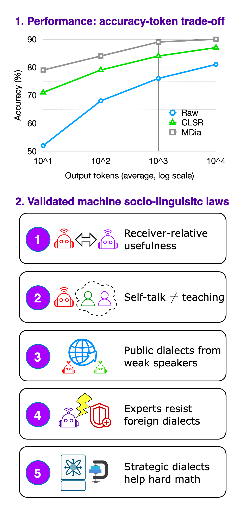

<h1 align="center">Machine Dialectology</h1>

<p align="center">
  <b>Let LLMs invent, evolve, exchange, and route compact machine dialects for efficient reasoning.</b>
</p>

<p align="center">
  <a href="https://github.com/pzqpzq/LSF_MDia"></a>
  
  
  
  
</p>

<p align="center">
  <b>CLSR</b> · <b>MDia-v1</b> · <b>MDia-Routed-v2</b>
</p>

<p align="center">
  <a href="https://icml.cc/virtual/2026/poster/61557"><b>📄 CLSR @ ICML 2026</b></a>
  &nbsp;·&nbsp;
  <a href="https://openreview.net/pdf?id=ovpL0ujD6j"><b>Paper PDF</b></a>
  &nbsp;·&nbsp;
  <a href="https://github.com/pzqpzq/Principia"><b>🚀 Principia: Principle-First Idea Discovery</b></a>
</p>


---

## Overview

**Machine Dialectology (MDia)** studies how heterogeneous LLM agents can create, inherit, exchange, and route compact symbolic languages for reasoning. Instead of forcing every model to express intermediate reasoning as long natural-language Chain-of-Thought, this repository explores **Language Symbolism Frameworks (LSFs)**: reusable, machine-oriented symbolic protocols that compress reasoning into compact operators, schemas, constraints, and routing contracts.

This repository currently contains three connected releases:

| Release | Folder | Role | Core contribution |
|---|---|---|---|
| **LSF-v0 / CLSR prototype** | `LSF-v0-draft/` | Early CLSR research code | Initial LSF generation, evolution, and evaluation scripts. |
| **LSF-v1 / MDia-v1** | `LSF-v1/` | Machine Dialectology prototype | Extends CLSR from single-type LLM agents to heterogeneous LLM communities, cross-agent discussion, and profile-aware routing. |
| **LSF-v2 / MDia-Routed-v2** | `LSF-v2/` | Clean release | Routed dialect controller with compact runner, route map, evaluators, and representative frontier data. |

<p align="center">
  
</p>

<p align="center"><i>Communication pressure + reuse + selection → emergent machine dialects.</i></p>

---

## Why machine dialects?

Long natural-language rationales are often useful for humans, but they are not necessarily the most efficient intermediate representation for LLM-to-LLM or LLM-internal reasoning. MDia asks a different question:

> Can LLM agents develop compact, reusable, socially transferable symbolic dialects that preserve correctness while reducing generated tokens?

The working hypothesis is that different LLMs have different *dialect preferences*: a concise notation that is useful for one listener model, one task family, or one reasoning regime may not be optimal for another. MDia therefore treats dialects as **receiver-relative, task-conditioned, and socially transferable artifacts**, not just as shorter prompts.


---

## Paper and downstream application

**CLSR** appears in the ICML 2026 paper **[“When LLMs Develop Languages: Symbolic Communication for Efficient Multi-Agent Reasoning”](https://icml.cc/virtual/2026/poster/61557)**. The paper introduces **Communicative Language Symbolism Routing (CLSR)** as a test-time framework where multiple LLM agents autonomously invent, evolve, share, and route compact **Language Symbolism Frameworks (LSFs)** to improve the accuracy–token trade-off.

**[Principia](https://github.com/pzqpzq/Principia)** is a downstream application direction of MDia: a **principle-first automatic idea discovery system** for research ideation, literature-grounded principle mining, and structured idea management. In Principia, MDia can serve as a reasoning substrate that improves the **reasoning-token frontier** while also encouraging LLM agents to create compact symbolic systems, reusable logic operators, and compressed reasoning chains. These machine-created dialects can help transform implicit reasoning traces into deeper, more structured, and more testable research ideas.


## Conceptual lineage

### CLSR: Communicative Language Symbolism Routing

**CLSR** introduces a test-time framework where LLM agents synthesize and evolve compact LSFs, then route among them to optimize the accuracy–token trade-off. In CLSR:

1. seed exemplars are sampled from a benchmark;
2. an LLM invents initial LSFs;
3. LSF-conditioned responses are generated;
4. correct and token-efficient traces are selected;
5. the LSF pool is refined through iterative propose → evaluate → select → mutate rounds;
6. a router selects, aggregates, or composes LSFs at inference time.

The main idea is not to hand-design a formal language. Instead, the LLM proposes symbolic conventions, and selection pressure keeps the ones that are compact, reusable, and accurate.

### MDia-v1: Machine Dialectology

**MDia-v1** generalizes CLSR from a single-type LLM-agent setting to a heterogeneous machine society. Rather than cold-starting from a meta-LSF, multiple model families first answer tasks directly; MDia then selects high-leverage responses across agents and uses cross-agent discussion to synthesize dialects suited to different speaker–listener pairs.

| Aspect | CLSR | MDia / Machine Dialectology |
|---|---|---|
| Main status | ICML-version CLSR framework | Broader journal-level extension direction |
| Core idea | LLM-generated LSFs for efficient reasoning | Machine dialectology across heterogeneous LLM agents |
| Agent setting | A specific LLM type | Multiple different LLM types |
| Initial step | Generate initial LSFs from exemplars | Agents first answer queries directly |
| Evolution signal | Correct and concise LSF-conditioned responses | Correct and concise responses collected across heterogeneous agents |
| Discussion pattern | Same-type LLM-to-LLM refinement | Cross-model and cross-category discussion |
| Routing | LSF routing for reasoning efficiency | Cross-category and cross-agent dialect routing |
| Experimental scope | ICML-version experiments | Broader multi-model experiments |

### MDia-Routed-v2: compact routed dialect controller

**MDia-Routed-v2** is the cleaned minimal release intended for `LSF-v2/`. It implements a routed dialect controller that selects a compact internal route from observable benchmark metadata, builds a strict JSON-oriented prompt, calls an OpenAI-compatible API, and evaluates predictions with lightweight benchmark-specific parsers.

The v2 router intentionally does **not** use task IDs, gold labels, or model outputs for route selection. Its goal is a simple, auditable, metadata-only routing layer that demonstrates a strict accuracy–token frontier advantage on supplementary benchmarks.

### From machine dialects to principle-first idea discovery

MDia is not limited to benchmark-time reasoning compression. A natural deployment scenario is **scientific and technical idea discovery**, where the objective is not merely to produce fluent hypotheses, but to generate ideas with clear principles, evidence, assumptions, novelty contrasts, and validation paths.

We are exploring this direction through **[Principia](https://github.com/pzqpzq/Principia)**, a **principle-first automatic idea discovery system**. Principia treats research ideation as a structured loop:

```text
literature evidence
→ reusable principles
→ idea operators
→ traceable idea cards
→ validation plans
→ feedback into research memory
```

MDia can strengthen this loop in two complementary ways:

1. **Reasoning-token frontier improvement.** MDia routes compact machine dialects so that Principia can spend fewer generated tokens on redundant natural-language deliberation while preserving, or improving, the quality of scientific reasoning.
2. **Dialect-driven idea formation.** Instead of forcing every intermediate thought into ordinary prose, MDia allows LLM agents to create symbolic operators, compressed reasoning chains, and task-specific logic protocols. These machine-created dialects can act as reusable **idea operators**: they help expose hidden analogies, compress mechanism-level insights, and generate more structured, principle-grounded hypotheses.

In this sense, Principia is a practical product-level instantiation of the MDia philosophy: LLMs should not only answer questions; they should develop reusable symbolic languages for thinking, teaching, routing, and discovering new ideas.

---

## MDia pipeline

<p align="center">
  
</p>

MDia follows four high-level stages:

1. **Direct responses from diverse LLMs.** Heterogeneous agents solve tasks directly, producing model-specific traces.
2. **High-leverage trace selection.** Correct and concise traces are selected as evidence of useful dialectal conventions.
3. **Cross-agent discussion and dialect synthesis.** Agents discuss, compress, and convert strong traces into candidate meta-dialects.
4. **Dialect pool evolution.** Dialects are scored, selected, inherited, and mutated over generations.

<details>
<summary><b>Additional pipeline figures</b></summary>

<p align="center">
  
</p>

<p align="center">
  
</p>

<p align="center">
  
</p>

</details>

---

## Repository structure

```text
LSF_MDia/
├── README.md
├── LSF-v0-draft/                    # CLSR prototype scripts
│   ├── llm_utils/
│   ├── evolve-PLL-v1.py
│   ├── eval-evolvePLL-v1.py
│   └── get_evolved_samples_v1.py
│
├── LSF-v1/                          # MDia-v1 prototype
│   ├── llm_utils/
│   ├── lsf_evolve_records/
│   ├── raw_llm_preds/
│   ├── single_lsf_preds/
│   ├── routed_lsf_preds/
│   ├── evolve_LSF_apr21.py
│   ├── eval_LSFs_apr21.py
│   └── llm_router_reproduce_mdia.py
│
└── LSF-v2/                          # MDia-Routed-v2 clean minimal release
    ├── mdia/
    │   ├── __init__.py
    │   ├── routing.py               # Observable metadata router
    │   ├── prompts.py               # Route-aware prompt builder
    │   ├── client.py                # OpenAI-compatible API client using env vars
    │   ├── evaluate.py              # Lightweight task evaluators
    │   └── io_utils.py              # JSONL / CSV helpers
    ├── scripts/
    │   ├── run_mdia_routed.py       # Run MDia-Routed-v2 on a task JSONL file
    │   └── summarize_frontier.py    # Summarize selected routed outputs
    ├── configs/
    │   ├── route_map.json
    │   └── model_config.example.json
    ├── data/
    │   ├── baseline_overall.csv
    │   ├── mdia_routed_v2_official_win.csv
    │   ├── accuracy_token_frontier.csv
    │   ├── selected_outputs_summary.csv
    │   ├── selected_routed_outputs.jsonl
    │   └── DATA_NOTES.md
    ├── assets/
    │   └── pipeline/
    │       ├── 1a.png
    │       ├── 1b.png
    │       ├── 1c.png
    │       ├── 1d.png
    │       └── 1e.png
    └── requirements.txt
```

> The README assumes the uploaded `mdia_routed_v2_release/` package is placed in this repository as `LSF-v2/`, and the uploaded pipeline figures are placed under `LSF-v2/assets/pipeline/`.

---

## MDia-Routed-v2 route map

MDia-Routed-v2 uses a small metadata router. The routing decision is made from observable benchmark-level or subtype-level fields only.

| Benchmark | Metadata key | Route | Intuition |
|---|---|---|---|
| BFCL v3 | benchmark-level route | `rmdia_bfcl_parallel_zip` | Schema-aware function calling, especially parallel “respectively” requests. |
| LiveCodeBench-output | benchmark-level route | `rmdia_schema` | Schema-first decoding for strict output contracts. |
| MultiHopRAG | `comparison_query` | `rmdia_silent` | Minimal direct-answer route for simple evidence bridges. |
| MultiHopRAG | `inference_query` | `rmdia_verify` | Silent candidate generation plus short verification. |
| MultiHopRAG | `null_query` | `rmdia_mhop_yesno_guard` | Null-aware yes/no guard to reduce over-answering. |
| MuSR | `murder_mystery` | `rmdia_contrast` | Compact contrastive candidate elimination for narrative reasoning. |
| MuSR | `object_placements` | `rmdia_contrast` | Compact contrastive candidate elimination for narrative reasoning. |
| MuSR | `team_allocation` | `rmdia_schema` | Schema-first decoding for structured choice tasks. |

---

## Experimental snapshots

### MDia-Routed-v2

MDia-Routed-v2 has **higher accuracy than the best baseline** and **fewer mean completion tokens than the lowest-token baseline** in the included representative slice.

| Benchmark | n | MDia-Routed-v2 acc. | Best baseline acc. | MDia-Routed-v2 tokens | Lowest baseline tokens | Win |
|---|---:|---:|---:|---:|---:|---|
| BFCL v3 | 75 | **72.00%** | 62.67% | **36.2** | 54.4 | yes |
| LiveCodeBench-output | 40 | **22.50%** | 20.00% | **24.2** | 75.1 | yes |
| MultiHopRAG | 60 | **96.67%** | 90.00% | **7.8** | 11.2 | yes |
| MuSR | 60 | **55.00%** | 51.67% | **36.0** | 51.1 | yes |


---

## Installation

Clone the repository:

```bash
git clone https://github.com/pzqpzq/LSF_MDia.git
cd LSF_MDia
```

Create an environment:

```bash
python -m venv .venv
source .venv/bin/activate
python -m pip install --upgrade pip
```

Install dependencies for the prototype scripts:

```bash
pip install openai
```

For `LSF-v2/`, the minimal runner uses only the Python standard library. Python 3.10+ is recommended.

---

## API configuration

The code uses OpenAI-compatible chat-completion endpoints. Do not hard-code credentials in scripts or config files.

For MDia-Routed-v2:

```bash
export MDIA_API_KEY="your_api_key_here"
export MDIA_API_BASE="https://api.siliconflow.cn/v1"
```

For older LSF-v1 scripts and the reproduction router:

```bash
export SILICONFLOW_API_KEY="your_api_key_here"
# or
export OPENAI_API_KEY="your_api_key_here"
```

---

## Quickstart: MDia-Routed-v2

Run MDia-Routed-v2 on a JSONL task file:

```bash
cd LSF-v2

python scripts/run_mdia_routed.py \
  --input path/to/tasks.jsonl \
  --output runs/mdia_routed_v2_outputs.jsonl \
  --model Qwen/Qwen3.5-9B
```

Inspect prompts without calling the API:

```bash
python scripts/run_mdia_routed.py \
  --input path/to/tasks.jsonl \
  --output runs/dry_run_prompts.jsonl \
  --model Qwen/Qwen3.5-9B \
  --dry-run-prompts
```

Summarize compact routed outputs:

```bash
python scripts/summarize_frontier.py \
  --outputs data/selected_routed_outputs.jsonl \
  --baseline-csv data/baseline_overall.csv \
  --out-csv runs/selected_outputs_summary.csv
```

---

## Quickstart: LSF-v1 / MDia-v1 router

The LSF-v1 router implements a paper-style pipeline:

```text
profile-aware category pruning
→ compact protocol planning
→ deterministic execution over existing LSFs
→ accuracy / generated-token evaluation
```

Example:

```bash
cd LSF-v1

python llm_router_reproduce_mdia.py \
  --data_card gpqa \
  --lsf_dir lsf_evolve_records/gpqa \
  --max_lsf 12 \
  --profile_n 20 \
  --max_num_test 100 \
  --inference_model Qwen/Qwen3.5-35B-A3B \
  --router_model Qwen/Qwen3.5-9B \
  --judge_model Qwen/Qwen3.5-9B \
  --run_baseline
```

The router supports three compact execution modes:

| Mode | Name | Meaning |
|---|---|---|
| `M:S` | single LSF | Use one selected dialect for direct answer. |
| `M:A` | multi-LSF aggregation | Run several dialects and aggregate, e.g., majority vote or judge selection. |
| `M:C` | multi-round composition | Compose dialects sequentially for harder problems. |

---

## Quickstart: LSF-v0 / CLSR prototype

Early prototype scripts are kept for reproducibility and historical continuity:

```bash
cd LSF-v0-draft
python evolve-PLL-v1.py
python eval-evolvePLL-v1.py
python get_evolved_samples_v1.py
```

The v0 scripts are not as clean as the v2 release. They are best treated as research-workspace scripts for understanding the evolution path from CLSR prototypes to MDia.

---

## MDia-Routed-v2 task JSONL format

`scripts/run_mdia_routed.py` expects one task per JSONL line. Gold fields are optional for generation. If gold fields are absent, the runner still writes predictions and parse status, while `success` is set to `null`.

<details>
<summary><b>MuSR</b></summary>

```json
{
  "task_id": "musr_0",
  "benchmark": "musr",
  "subdomain": "object_placements",
  "context": "...",
  "question": "...",
  "choices": ["A", "B", "C"],
  "gold_index": 0,
  "gold_answer": "A"
}
```

</details>

<details>
<summary><b>MultiHopRAG</b></summary>

```json
{
  "task_id": "mhop_0",
  "benchmark": "multihop_rag",
  "question_type": "comparison_query",
  "question": "...",
  "evidence": [
    {"source": "...", "title": "...", "fact": "..."}
  ],
  "gold_answer": "..."
}
```

</details>

<details>
<summary><b>BFCL v3</b></summary>

```json
{
  "task_id": "bfcl_0",
  "benchmark": "bfcl",
  "category": "parallel",
  "question": "...",
  "functions": [
    {
      "name": "tool.name",
      "description": "...",
      "parameters": {
        "type": "object",
        "properties": {},
        "required": []
      }
    }
  ],
  "gold": []
}
```

</details>

<details>
<summary><b>LiveCodeBench-output</b></summary>

```json
{
  "task_id": "lcb_0",
  "benchmark": "livecodebench_output",
  "difficulty": "easy",
  "question_title": "...",
  "question": "...",
  "test_input": "...",
  "gold_output": "..."
}
```

</details>

---

## Included MDia-Routed-v2 data artifacts

The `LSF-v2/data/` folder is intentionally compact. It includes representative artifacts rather than the full experiment workspace.

| File | Purpose |
|---|---|
| `baseline_overall.csv` | Aggregate raw, raw CoT, SoT, CoD, and original MDia baselines across five model families. |
| `mdia_routed_v2_official_win.csv` | Strict official-win table for MDia-Routed-v2. |
| `accuracy_token_frontier.csv` | Combined baseline and MDia-Routed-v2 points for plotting accuracy vs. completion tokens. |
| `selected_outputs_summary.csv` | Summary regenerated from selected routed outputs. |
| `selected_routed_outputs.jsonl` | Selected row-level routed outputs, sanitized and compact. |
| `DATA_NOTES.md` | Notes on data scope, omissions, and intended use. |

A typical selected output row contains:

```json
{
  "benchmark": "bfcl",
  "model": "Qwen/Qwen3.5-9B",
  "task_id": "bfcl_...",
  "method": "MDia-Routed-v2",
  "route": "rmdia_bfcl_parallel_zip",
  "route_key": "_default",
  "success": true,
  "parse_ok": true,
  "completion_tokens": 36,
  "prediction": "...",
  "model_output": "..."
}
```

---

## Machine sociolinguistic observations

MDia frames LLM reasoning as a machine-sociolinguistic process. Early observations include:

1. **Receiver-relative usefulness.** A dialect is not intrinsically strong or weak; it is strong for a particular listener under a particular task distribution.
2. **Self-talk is not teaching.** A dialect can fail as self-talk yet succeed as a teaching language for another model.
3. **Public dialects can come from weak speakers.** Smaller or less accurate models may still produce highly adoptable compact conventions.
4. **Experts sometimes resist foreign dialects.** Stronger listener models may reject or underuse dialects that constrain their richer internal procedures.
5. **Strategic dialects help hard tasks.** Expert-style strategy dialects can help strong but verbose listeners on difficult math and reasoning tasks.

In short, LLMs do not merely reason; they can invent dialects, teach through dialects, resist dialects, and code-switch across domains.

---

## Citation

If you use this repository, please cite the CLSR paper and this repository.

```bibtex
@inproceedings{pei2026lsf,
  title     = {When LLMs Develop Languages: Symbolic Communication for Efficient Multi-Agent Reasoning},
  author    = {Pei, Zhengqi and Huang, Qingming and Wang, Shuhui},
  booktitle = {Proceedings of the 43rd International Conference on Machine Learning},
  year      = {2026}
}
```

A dedicated MDia citation will be added when the Machine Dialectology extension is finalized.

---

## Contact

**Academic collaboration**  
In collaboration with the **[Institute of Computing Technology, Chinese Academy of Sciences](https://english.ict.cas.cn/)**.  
Contact: [peizhengqi22@mails.ucas.ac.cn](mailto:peizhengqi22@mails.ucas.ac.cn)

**Business collaboration**  
In collaboration with **Beijing Chipflow Technology Co., Ltd.**. 
Contact: [peizhengqi@chipflow.net](mailto:peizhengqi@chipflow.net)
