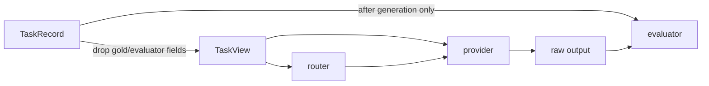

# Architecture

MDia has one supported, config-driven package. Its central object is not a prompt string but a versioned relation among a task, speaker, listener, dialect card, route plan, response, evaluator, and cost record.

## Components

| Component | Responsibility |
|---|---|
| `schemas.py` | Immutable Pydantic contracts, stable identities, digests, and validation |
| `config.py` | Load and validate provider, dataset, partition, lifecycle, route, rule, and run settings |
| `datasets/` | Convert external datasets into partitioned `TaskRecord` values |
| `providers/` | Execute model/replay requests through the `ChatProvider` boundary |
| `pipeline/` | Collect, create, evolve, profile, select, run, checkpoint, and report |
| `routing/` | Concrete-card `DialectRouter`, optional `ControllerRouter`, budgets, stops, and aggregation |
| `evaluation/` | Parse predictions, call diagnostic/official evaluators, and account for tokens/cost |
| `rules/` | Registry, statistical validators, multiple-testing correction, and evidence reports |

External integrations depend on public protocols rather than pipeline internals:

```python
DatasetAdapter.load(split) -> Iterable[TaskRecord]
ChatProvider.complete(request) -> Completion
Evaluator.evaluate(task, output) -> EvaluationRecord
DialectRouter.route(task_view, listener_profile, bank, budget) -> DialectRoutePlan
ControllerRouter.route(task_metadata, listener_profile, budget) -> ControllerRoutePlan
```

## Data contracts

The main validated records are:

- `TaskRecord`: stable item ID, one immutable split, query content, observable metadata, and evaluator-only gold data;
- `TraceRecord`: provider request/response provenance, parsed output, correctness, token/latency/cost fields, and source IDs;
- `DialectCard`: `D = (V, G, O, R, rho)`, lifecycle provenance, I/O contract, fallback, and specification digest;
- `DialectProfile`: listener- and task-conditioned validation metrics with support and confidence intervals;
- `DialectRoutePlan`: concrete card IDs/digests, route mode, aggregator, budget, stop rule, and fallback;
- `ControllerRoutePlan`: optional controller family and answer contract, separate from card selection;
- `EvaluationRecord`: evaluator identity, parsed answer, correctness/score, parse status, and diagnostics;
- `RuleSpec` and `RuleResult`: falsifiable hypothesis contract and evidence-linked result; and
- `RunManifest`: schema/code/config/provider revisions, seeds, split hashes, candidate pool, and artifact checksums.

Stable IDs are derived from canonical content rather than filenames or list position. The specification digest covers `V`, `G`, `O`, `R`, the task tags, and the I/O/fallback contract. Validation can enrich `rho` and attach profile IDs without silently changing the dialect specification or its stable ID. A route plan is invalid if its ID/digest pair does not resolve to the frozen bank.

## Leakage boundary

`TaskRecord` may contain evaluator-only gold data, but generation and routing receive a `task_view` that contains only query text and observable metadata. The data flow is deliberately one-way:



Induction, evolution validation, router validation, and test manifests are immutable and content-hashed. No selected test record may influence card creation, generation selection, profile construction, or route choice.

## Two routing layers

The **DialectRouter** is the primary MDia interface. It selects one or more concrete cards from a frozen bank and returns their stable IDs and specification digests. This is also the router used by CLSR.

The optional **ControllerRouter** selects a metadata-conditioned reasoning/answer-contract family. It is useful for format-sensitive tasks where schema binding, evidence sufficiency, verification, or state tracking matters. It never masquerades as an evolved-card selection.

A canonical event can therefore record:

```text
controller choice (optional) -> concrete dialect choice -> execution -> aggregation -> evaluation
```

`single`, `aggregate`, `compose`, and `abstain/raw-fallback` are distinct route modes. Majority, validation-weighted, score-based, and judge aggregation are distinct algorithms. A route records its pre-generation token estimate; execution enforces the generated-completion budget across every dialect call and any judge call. The built-in routers are deterministic and generate no planning tokens; an external model-backed router must declare and account for its own overhead. Stop rules prevent uncontrolled multi-round cost.

## Lifecycle and durability

Each generation is written as a complete checkpoint and promoted atomically. A resumed run validates the config hash, split hashes, parent generation, and artifact checksums before continuing. Evolution terminates only when the configured validation utility saturates, never because a filename appears last.

Selection reads validation profiles only. Cards must meet minimum support and then compete on the accuracy/cost/parse-risk Pareto frontier; diversity constraints can retain multiple speakers or task competencies.

All outputs live under `runs/<run_id>/`. The run manifest is the index of truth: reports and release manifests must be rebuildable from its artifact paths and checksums.

## CLSR preset

CLSR uses the same code and records while restricting creators, speakers, and listeners to one backbone community. Cross-family ecology and rule claims are disabled. Concrete-card single, aggregate, compose, and validation-profiled fixed-single policies remain available. This makes CLSR a constrained configuration of MDia rather than a separate package generation.
